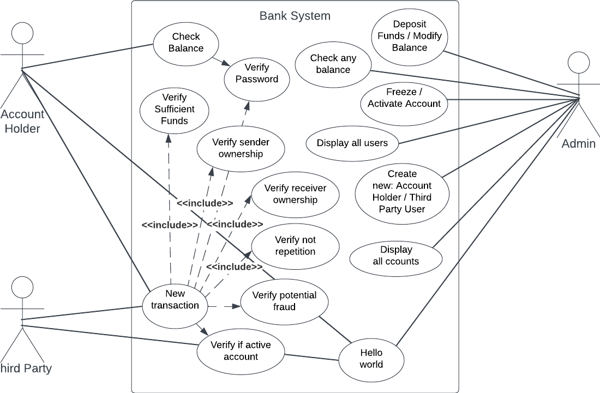
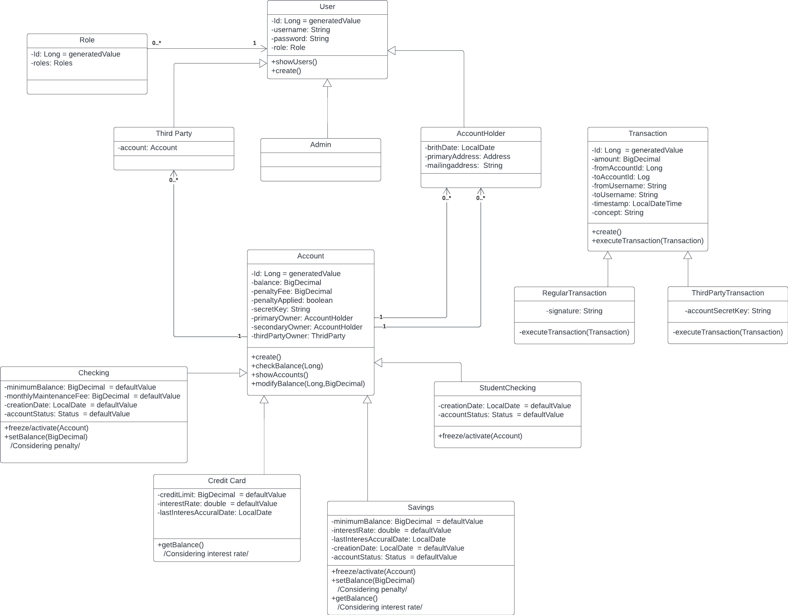
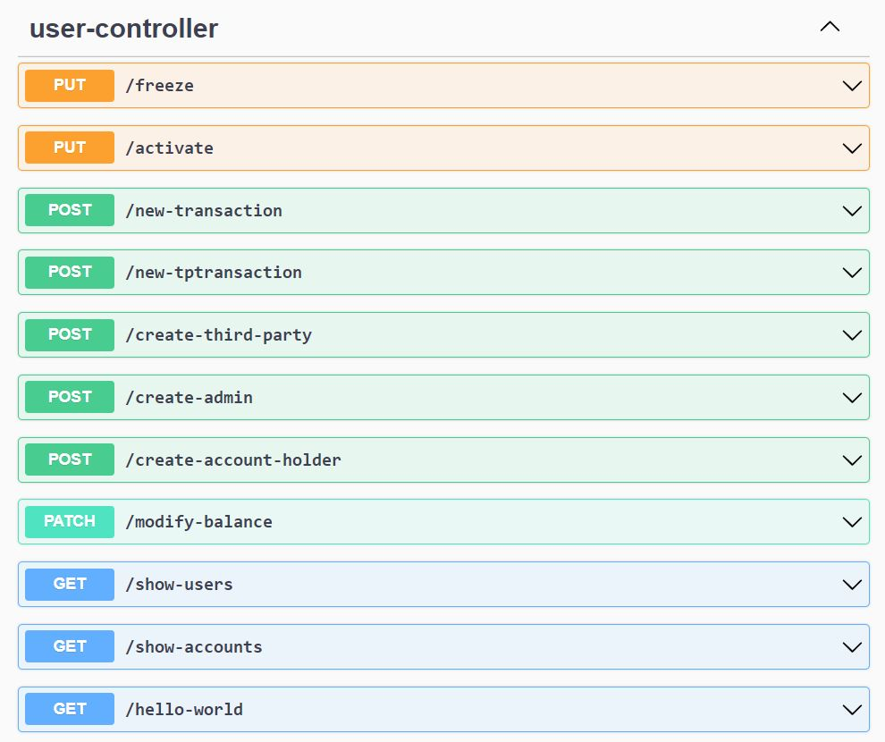

# BANK SYSTEM

Delivered Personal Project (IRONHACK) - BANK SYSTEM

This Bank System allows us to make requests in order to:

- Create new users if you are an admin.
- Create new accounts if you are an admin.
- Modify balance of any account if you are an admin.
- Activate accounts if you are an admin
- Freeze accounts if you are an admin
- Check balance of your account (You need authentication)
- Send funds to account of this bank or to other third parties
- Receive funds
- Receive interests in your Savings or Credit Card Account

## Diagrams

Case Diagram



Class Diagram



## How to try it

This Bank System provides a simple graphic interface to make requests.



## Requirements

You need to have installed IntelliJ and MySQL if you want to try it locally.

You have another option though: This project is deployed automatically to a Kubernetes Cluster in Digital Ocean, so you can try it in the following link: (Ask the owner for the link)

## Usage

There are three types of users:
Admins, AccountHolders and Third Parties

There are four types of accounts: Checking, Savings, Student Checking or CreditCard Accounts.

Admins can create new accounts. When creating a new account they can create Checking, Savings, or CreditCard Accounts.
Student Checking Accounts are created automatically if Checking Account owner is younger than 24.

Savings and CreditCard accounts have interests rates that are paid monthly.

Checking and Savings Account need to have a minimum amount of balance. When going under that balance a penalty fee is applied (Just once)

Following requests can be made:

(GET)   socket/hello-world: To check communication.

(GET)   socket/show-accounts: To see all accounts.

(GET)   socket/show-users: To see all users.

(POST)  socket/create-account-holder: To create a new Account Holder. (Just Admins)
```json
{
	"username"  : "userH",
	"password"  : "passwordH",
	"role"      : "ACCOUNT_HOLDER",
	"birthDate" : ">>Not tested yet<<"
}
```

(POST)  socket/create-admin: To create a new Admin. (Just Admins)
```json
{
	"username"  : "userA",
	"password"  : "passwordA",
	"role"      : "ADMIN"
}
```

(POST)  socket/create-tpthird-party: To create a new Third Party user. (Just Admins)
```json
{
	"username"  : "userT",
	"password"  : "passwordT",
	"role"      : "THIRD_PARTY"
}
```

(GET)   socket/balance: To check an account balance. (Just Admins)
	
	socket/balance?id=1

(PATCH) socket/modify-balance: To modifiy an account balance. (Just Admins)
	
	socket/modify-balance/?id=1&amount=200

(PUT) socket/activate: To activate an account. (Just Admins)

	socket/activate?id=2

(PUT) socket/freeze: To freeze an account. (Just Admins)

	socket/freeze?id=2

(GET)   socket/balance/{accountId}: To check your own balance. (You need to be authenticated)
	
	socket/balance/{accountId}

(POST)  socket/new-transaction: To make a new transaction.
```json
{
	"amount": 15,
	"fromAccountId":1,
	"toAccountId":3,
	"fromUsername":"auxdemoUser",
	"toUsername":"ThirdPartyUser",
	"signature":"password",
	"concept": "Test transaction"
}
```

(POST)  socket/new-tptransaction: To make a new transaction in case you are a Third party.
```json
{
	"amount": 15,
	"fromAccountId":3,
	"toAccountId":1,
	"fromUsername":"ThirdPartyUser",
	"toUsername":"auxdemoUser",
	"accountSecretKey":"password",
	"concept": "Test transaction"
}
```

Conditions for a transaction to be successful:
- Issuer needs to have enough balance.
- Amount on transaction cannot be negative .
- Issuer username needs to belong to the Issuer Account.
- Receiver username needs to belong to the Receiver Account.
- Transaction needs to be signed with issuer password.
- Neither issuer nor receiver account can be FROZEN.
- Identical transaction cannot be made in less than 1 minute.
- Third party users can also send and receive funds.
- Making several transactions in less than 1 second freezes the account.
- Making transactions over 150% of the number of transactions you have ever made in 24h freezes the account.

## Contributing

Pull requests are welcome

## License

[MIT](LICENSE.txt)
